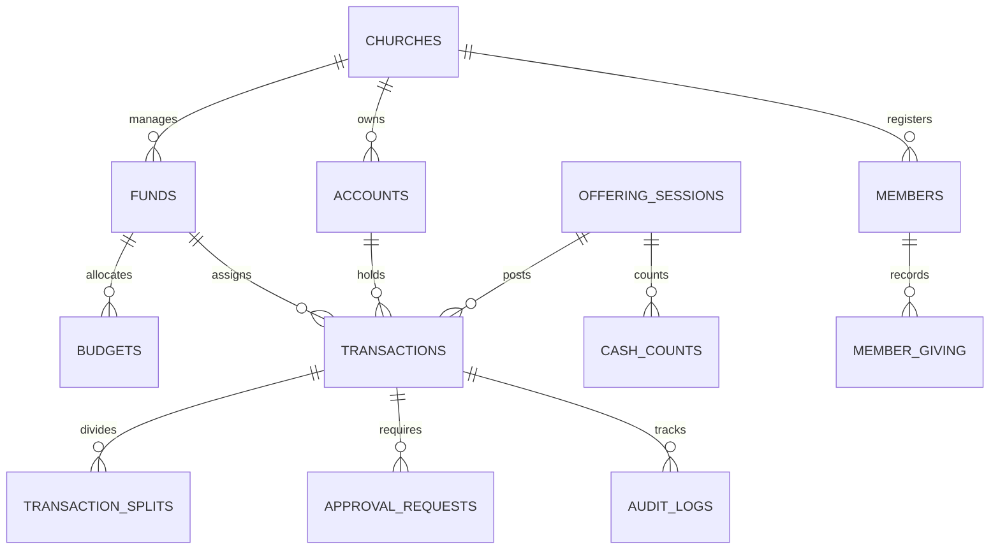
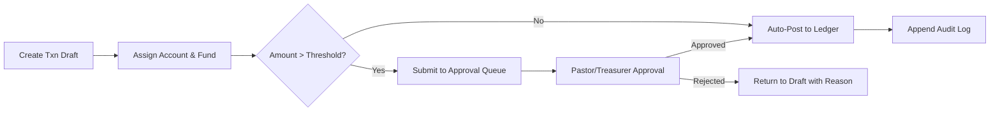
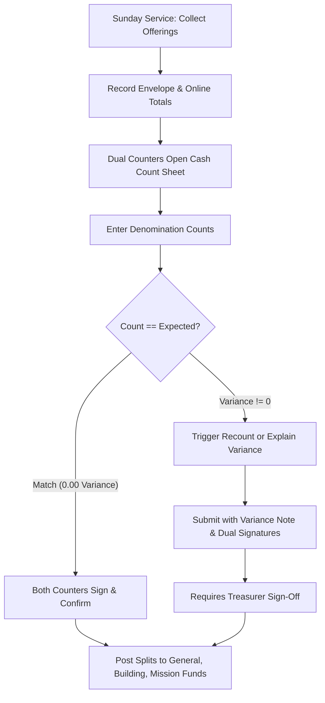

> **Note — planning document, not the current architecture.**
> This document is an early planning and audit report. It records a proposed
> stack (React 19, TanStack Router, Tailwind CSS) that the project did not
> adopt. The actual implementation is Vanilla TypeScript + Vite, with no
> React, no router framework, and no Tailwind. For the current architecture,
> read `README.md` and `CONTEXT.md` at the repository root. Keep the content
> below for historical reference only.

# Grace Ledger — Production Financial OS: Comprehensive Audit Report

**Document Status:** Complete Audit & Production Blueprint  
**Auditor:** Principal Engineer / System Architect  
**Project:** Grace Ledger (Church Financial Operating System)  
**Target Milestone:** Transition from Design System & UI Mockups to Production-Grade Financial OS  
**Source Packages Inspected:**
1. `Grace Ledger Design System` (`design-system-extracted/`)
2. `Grace Ledger UI Mockups` (`mockups-extracted/`)

---

## 1. Executive Summary

Grace Ledger has reached an exceptionally high level of UI/UX maturity with a complete, consistent design token system, 14 verified React primitives, and 18 high-fidelity mobile OS screens across 5 core church financial workflows. 

However, inspecting the transition path from **"Design Prototype & Static UI Kit"** to **"Production-Grade Church Financial OS"** reveals critical architectural and domain-level gaps. The application must govern non-negotiable accounting rules—such as strict fund-accounting invariants (*"every single Baht belongs to exactly one designated fund"*), dual-control cash counting with variance tracking, immutable double-entry style audit trails, and strict confidentiality of member giving records.

This audit establishes a grounded baseline, maps all 18 mockup screens to concrete full-stack routes, evaluates database constraints and Row-Level Security (RLS) policies, categorizes critical P0–P3 risks with specific evidence, and outlines the precise 5-milestone execution plan.

---

## 2. Current Architecture

### 2.1 Workspace Analysis & Asset Inventory

The workspace currently houses two primary unpacked bundles:
- `design-system-extracted/`:
  - **Tokens:** `tokens/colors.css`, `tokens/typography.css`, `tokens/spacing.css`, `tokens/radius.css`, `tokens/shadows.css`, `tokens/motion.css`, `tokens/fonts.css`, `tokens/base.css`.
  - **Components:** 14 standalone React components under `components/` (`data/`, `feedback/`, `forms/`, `navigation/`, `overlays/`).
  - **Interactive Shell:** `ui_kits/grace-ledger/` (Dashboard, Login, IncomeEntry, Approvals, Sidebar, Topbar with static `window.MOCK` data).
  - **Brand Assets:** `uploads/` (`Logo.png`, `Logo mark -icon.png`, `App Icon.png`).
- `mockups-extracted/`:
  - **Mobile Canvas:** `Grace Ledger Mobile OS.dc.html` (18 complete mobile screens in 5 workflow groups).
  - **Viewport Wrapper:** `ios-frame.jsx` (iPhone 390×844 device frame rendering).
  - **Manifest & Route Mapping:** `github.md` (mapping screens to TanStack Router route targets in `Suriyong1993/grace-ledger`).

### 2.2 Architectural Topology

```
                  ┌──────────────────────────────────────────────────────────┐
                  │                 GRACE LEDGER CLIENT                      │
                  │  (React 19 + TanStack Router/Start + Tailwind CSS v4)   │
                  └─────────────┬───────────────────────────────┬────────────┘
                                │                               │
                   (Mobile Shell / Bottom Nav)      (Desktop Shell / Sidebar)
                   18 Mockup Screens (5 Flows)       App Shell / Data Tables
                                │                               │
                                └───────────────┬───────────────┘
                                                │
                                     [ TanStack Query / RPC ]
                                                │
                  ┌─────────────────────────────▼────────────────────────────┐
                  │                 SUPABASE BACKEND / POSTGRES              │
                  ├──────────────────────────────────────────────────────────┤
                  │ 1. PostgreSQL Schema (Accounts, Funds, Txns, Sessions)   │
                  │ 2. Row Level Security (RBAC: Admin, Pastor, Treasurer)   │
                  │ 3. PL/pgSQL Atomic Functions (Cash Count, Transfers)     │
                  │ 4. Immutable Audit Logs & Append-Only Event Stream       │
                  │ 5. Encrypted Member Giving & Strict Permission Scopes    │
                  └──────────────────────────────────────────────────────────┘
```

---

## 3. Technology Stack

The stack is locked to avoid fragmentation:

| Layer | Standard Specification | Current Status / Target |
| :--- | :--- | :--- |
| **Frontend Framework** | React 19 (Strict Mode, Concurrent Features) | Present in UI kit declarations |
| **Routing / SSR** | TanStack Router + TanStack Start | Specified in route manifests |
| **Styling & Tokens** | Tailwind CSS v4 + Vanilla CSS Custom Properties | Complete in `tokens/*.css` |
| **UI Primitives** | shadcn/ui + Radix UI + Lucide React | 14 built; ~34 shadcn primitives in source |
| **Form Management** | React Hook Form + Zod v3 | Required for multi-step wizards & validation |
| **State & Data Fetching**| TanStack Query v5 + Optimistic Updates | Required for offline/mobile latency |
| **Database & Auth** | Supabase (PostgreSQL 16 + Supabase Auth + RLS) | Target production engine |
| **File Storage** | Supabase Storage (Receipts & Attachments bucket) | Private bucket with signed URLs |
| **Testing** | Vitest + Playwright + Testing Library | Needed for accounting calculation test suites |
| **Deployment** | Vercel (Edge/Serverless SSR) + Supabase Cloud | Standard deployment pipeline |

---

## 4. Mockup → Route Matrix (18 Mobile Screens)

All 18 screens from `Grace Ledger Mobile OS.dc.html` are mapped below to routes, components, data dependencies, server functions, and RBAC permissions:

| Screen # | Mockup Screen Name | Route Path | React Component | Data Sources & Tables | Server Function / RPC | Auth & RBAC |
| :---: | :--- | :--- | :--- | :--- | :--- | :--- |
| **01** | หน้าหลัก (Home) | `/_app/dashboard` | `DashboardScreen` | `accounts`, `funds`, `transactions`, `approvals`, `offering_sessions` | `get_dashboard_summary()` | Authenticated (All Staff/Admins) |
| **02** | รายการเงิน (Transactions) | `/_app/transactions` | `TransactionsScreen` | `transactions`, `funds`, `categories`, `accounts` | `list_transactions(filters)` | Authenticated (Viewer, Treasurer, Admin) |
| **03** | รายละเอียดรายการ (Txn Detail + Audit) | `/_app/transactions/$id` | `TransactionDetailScreen` | `transactions`, `transaction_splits`, `audit_logs`, `attachments` | `get_transaction_detail(id)` | Authenticated (Viewer, Treasurer, Admin) |
| **04** | บันทึกเงินถวาย ขั้นที่ 1 (Record Offering) | `/_app/offering/record` | `RecordOfferingStep1` | `offering_sessions`, `funds`, `categories`, `accounts` | `initiate_offering_session()` | Authenticated (Treasurer, Counter, Admin) |
| **05** | ตรวจทานก่อนบันทึก (Review Sheet) | `/_app/offering/review` | `OfferingReviewSheet` | `offering_session_items`, `funds` | `validate_offering_draft()` | Authenticated (Treasurer, Counter, Admin) |
| **06** | นับเงินสด - ยอดตรง (Cash Count Exact) | `/_app/offering/count` | `CashCountScreen` | `cash_count_denominations`, `offering_sessions` | `submit_cash_count()` | Dual Counter Role (2 Signatures required) |
| **07** | นับเงินสด - ยอดไม่ตรง (Cash Count Variance) | `/_app/offering/variance` | `CashVarianceScreen` | `cash_count_denominations`, `offering_sessions`, `variance_reasons` | `submit_cash_variance_recount()` | Dual Counter Role + Treasurer Confirmation |
| **08** | กองทุน (Funds Overview) | `/_app/funds` | `FundsListScreen` | `funds`, `fund_balances`, `budgets` | `get_funds_summary()` | Authenticated (Viewer, Treasurer, Admin) |
| **09** | รายละเอียดกองทุน (Fund Detail) | `/_app/funds/$id` | `FundDetailScreen` | `funds`, `transactions`, `budgets`, `fund_transfers` | `get_fund_breakdown(id)` | Authenticated (Viewer, Treasurer, Admin) |
| **10** | งบประมาณ (Budget 2026) | `/_app/budget` | `BudgetScreen` | `budgets`, `budget_categories`, `budget_actuals` | `get_annual_budget(year)` | Authenticated (Treasurer, Pastor, Admin) |
| **11** | รายการที่รออนุมัติ (Approvals Queue) | `/_app/approvals` | `ApprovalsQueueScreen` | `approval_requests`, `transactions`, `funds` | `get_pending_approvals()` | Approver Role (Pastor, Board, Treasurer) |
| **12** | หน้าอนุมัติ (Approval Decision Sheet) | `/_app/approvals/$id` | `ApprovalDecisionSheet` | `approval_requests`, `transactions`, `funds`, `attachments` | `execute_approval_action()` | Approver Role (Pastor, Board, Treasurer) |
| **13** | ตรวจสอบย้อนหลัง (Audit Trail) | `/_app/audit` | `AuditTrailScreen` | `audit_logs`, `auth.users`, `transactions` | `query_audit_trail(filters)` | Admin, Auditor, Head Treasurer only |
| **14** | การแจ้งเตือน (Notifications) | `/_app/notifications` | `NotificationsScreen` | `notifications`, `user_notification_prefs` | `get_user_notifications()` | Authenticated (User-scoped) |
| **15** | การถวายของสมาชิก (Member Giving Search) | `/_app/members/giving` | `MemberGivingSearchScreen` | `members`, `households`, `member_giving_records` | `search_member_giving()` | **Confidential Scope** (Pastor, Designated Treasurer) |
| **16** | ประวัติการถวายรายบุคคล (Member Detail) | `/_app/members/$id` | `MemberGivingDetailScreen` | `members`, `member_giving_records`, `tax_certificates` | `get_member_giving_history()` | **Confidential Scope** + Access Logged |
| **17** | รายงาน (Reports Hub) | `/_app/reports` | `ReportsHubScreen` | `monthly_summaries`, `offering_reports`, `fund_reports` | `get_report_catalog()` | Authenticated (Viewer, Treasurer, Admin) |
| **18** | โปรไฟล์และตั้งค่า (Settings & More) | `/_app/settings` | `SettingsScreen` | `church_profiles`, `user_roles`, `user_preferences` | `get_user_church_settings()` | Authenticated (Self & Admin scopes) |

---

## 5. Design System Compliance Audit

### 5.1 Design Tokens Analysis

The tokens in `tokens/*.css` are high-grade and well-structured:
- **Surfaces & Layout:** Background is locked to warm off-white (`#FFFCF8` / `var(--gl-bg)`), cards to pure white (`#ffffff` / `var(--gl-card)`), and text to dark charcoal (`#171717` / `var(--gl-ink)`).
- **Brand Accent:** Single orange accent (`#f97316` / `var(--gl-orange-600)`) reserved strictly for CTAs, active indicator bars, and focus rings. Never used as a large card background fill.
- **Financial Status Hues:**
  - Emerald (`oklch(0.5 0.13 155)`): Income / Approved.
  - Red (`oklch(0.55 0.17 25)`): Expense / Rejected / Destructive.
  - Amber (`oklch(0.7 0.13 80)`): Offering / Pending Action.
  - Blue (`#2563eb`): Information / Audit notices.
- **Typography:** Two-family pairing:
  - `Sarabun` (`var(--font-sans)`): For Thai UI strings (labels, descriptions, helper text).
  - `Inter` (`var(--font-display)`): For Latin text, titles, and numerals.
  - `.num-display` rule: Enforces `font-feature-settings: "tnum" 1, "lnum" 1` so columns of numbers align without shifting.
- **Motion & Elevation:**
  - Emil Kowalski ease-out curve (`cubic-bezier(0.23,1,0.32,1)`).
  - Duration hard ceiling at **400ms** (no bounce, no bouncy springs, no flashy tickers).
  - Border beats shadow: 1px hairline border is standard; shadows are soft (`var(--shadow-sm-card)`).

### 5.2 Component Gaps vs Production Needs

| Design System Component | Source Status | Production Readiness Gap | Remediation Required |
| :--- | :--- | :--- | :--- |
| `Button` | Built (JSX) | Uses inline styles; no Lucide icon integration | Convert to Tailwind v4 classes + Lucide React props |
| `Input` / `Select` | Built (JSX) | Basic uncontrolled state; no RHF/Zod validation bind | Wrap with React Hook Form `FormField` / `FormControl` |
| `MoneyText` | Built (JSX) | Takes raw float `value: number` | Support exact fixed-decimal string / cents to avoid IEEE 754 precision drift |
| `StatusBadge` | Built (JSX) | Has 5 statuses: draft, pending, approved, rejected, voided | Add offering status variants (`counting`, `recount_required`) |
| `Dialog` | Built (JSX) | Simple absolute modal | Upgrade to accessible `@radix-ui/react-dialog` with FocusTrap |
| `Drawer` / `BottomSheet` | Missing in bundle | Required for Mobile Screens 05, 12, and 18 "More" sheet | Integrate `@radix-ui/react-dialog` or `vaul` drawer primitive |
| `SundayCountSheet` | Missing in bundle | Required for Mobile Screens 06 & 07 (denominations table) | Build interactive denomination calculator component |
| `AuditTimeline` | Missing in bundle | Required for Mobile Screen 13 & Detail Screen 03 | Build chronological timeline item primitive |

---

## 6. Financial Domain Audit

### 6.1 Invariant #1: Fund Accounting Constraint
> **Rule:** *"Every single Baht belongs to exactly one designated fund at all times."*

- **Finding:** A generic transaction model `(id, amount, account_id, category_id)` fails church fund accounting. A church bank account (e.g. Kasikorn Bank ฿1,000,000) may hold ฿500,000 General Fund, ฿300,000 Building Fund, and ฿200,000 Mission Fund.
- **Requirement:** Every transaction entry must explicitly link to a `fund_id`. 
- **Split Transactions:** If a single offering deposit of ฿50,000 distributes across ฿30,000 General, ฿15,000 Building, and ฿5,000 Mission, the database must support `transaction_splits` where:
  $$\sum \text{Split Amounts} = \text{Total Transaction Amount}$$

### 6.2 Invariant #2: Fund Transfer Zero-Sum Integrity
> **Rule:** *Fund transfers cannot create or destroy church balance.*

- **Finding:** A fund transfer (e.g. ฿50,000 from General Fund to Building Fund) must be atomic.
- **Requirement:** A transfer transaction must record a dual-entry leg:
  - Source Fund leg: Amount = `-50,000.00`
  - Destination Fund leg: Amount = `+50,000.00`
  - Net Church Balance impact = `0.00`
  - Handled inside a single PostgreSQL transaction (`BEGIN ... COMMIT`) or RPC.

### 6.3 Invariant #3: Dual-Control Sunday Offering & Cash Variance
> **Rule:** *Sunday cash counting requires 2 independent counters, denomination breakdown, and immutable variance logging.*

- **Finding:** In Screen 06 & 07, offering money is counted by denomination (฿1,000, ฿500, ฿100, ฿50, ฿20, coins).
- **Current Mockup Flow:**
  1. Envelope/Offering initial entry (Expected total, e.g. ฿18,450.00).
  2. Physical cash count (Actual total, e.g. ฿18,250.00).
  3. Calculated variance: $\text{Variance} = \text{Actual} - \text{Expected} = -200.00$.
  4. If Variance $\neq 0$: The UI prohibits silent editing. It forces either a **Recount** or a **Confirmed Variance with Explanation & Dual Signature Confirmation**, which triggers an alert in the Approvals queue.

### 6.4 Invariant #4: Transaction Immutability & Audit Trail
> **Rule:** *Posted financial transactions are never deleted (`DELETE` prohibited).*

- **Finding:** Once approved/posted, editing a transaction requires either a voiding reversal or an audited correction record with before/after state saved in `audit_logs`.

### 6.5 Invariant #5: Money Precision & Rounding
> **Rule:** *Financial calculations must never lose satang precision due to binary floating-point representation.*

- **Finding:** JavaScript `Number` is double precision IEEE 754 ($0.1 + 0.2 = 0.30000000000000004$).
- **Requirement:** Database columns must use `NUMERIC(14, 2)` (or integer cents in Satang). Client calculations must use integer arithmetic or a precision library (`decimal.js` / `big.js`).

---

## 7. Database Schema Audit (Proposed Production DDL)

To support all 18 screens and financial invariants, the database schema must be organized into 5 relational modules:



### 7.1 Core Schema Entities

1. **`churches`**: Tenant isolation, profile, settings, currency (`THB`).
2. **`accounts`**: Bank accounts, cash drawers, petty cash (`id`, `church_id`, `name`, `type`, `account_number`, `balance`).
3. **`funds`**: General, Building, Mission, Youth (`id`, `church_id`, `name`, `description`, `target_amount`, `current_balance`, `is_active`).
4. **`categories`**: Chart of categories (`id`, `church_id`, `name`, `fund_id`, `direction: 'income' | 'expense'`).
5. **`transactions`**: Primary ledger (`id`, `church_id`, `account_id`, `fund_id`, `category_id`, `amount NUMERIC(14,2)`, `direction`, `status: 'draft' | 'pending' | 'approved' | 'rejected' | 'voided'`, `posted_at`, `created_by`, `approved_by`).
6. **`transaction_splits`**: Multi-fund allocation (`id`, `transaction_id`, `fund_id`, `category_id`, `amount NUMERIC(14,2)`).
7. **`fund_transfers`**: Inter-fund movements (`id`, `church_id`, `from_fund_id`, `to_fund_id`, `amount`, `status`, `approved_by`).
8. **`offering_sessions`**: Sunday offering records (`id`, `church_id`, `service_date`, `expected_amount`, `counted_amount`, `variance_amount`, `status: 'draft' | 'counting' | 'variance_review' | 'confirmed' | 'posted'`, `counter1_id`, `counter2_id`, `variance_reason`).
9. **`cash_count_denominations`**: Breakdown of counts (`id`, `session_id`, `bill_1000`, `bill_500`, `bill_100`, `bill_50`, `bill_20`, `coins`, `total_cash`).
10. **`budgets` & `budget_categories`**: Annual planning (`id`, `church_id`, `year`, `fund_id`, `allocated_amount`, `spent_amount`).
11. **`approval_requests`**: Workflow items (`id`, `church_id`, `entity_type`, `entity_id`, `requested_by`, `approver_id`, `status`, `note`, `responded_at`).
12. **`members` & `households`**: Church member directory (`id`, `church_id`, `full_name`, `household_id`, `member_code`, `joined_date`).
13. **`member_giving_records`**: Sensitive records (`id`, `church_id`, `member_id`, `offering_session_id`, `amount`, `giving_type: 'tithe' | 'general' | 'mission' | 'building' | 'special'`, `payment_method`, `confidential_note`).
14. **`audit_logs`**: Immutable trail (`id`, `church_id`, `user_id`, `action`, `entity_table`, `entity_id`, `old_data JSONB`, `new_data JSONB`, `ip_address`, `user_agent`, `created_at`).
15. **`notifications`**: User alert items (`id`, `church_id`, `user_id`, `type`, `title`, `body`, `action_url`, `read_at`).

---

## 8. RLS & Security Audit

### 8.1 Role-Based Access Control (RBAC) Matrix

| Role | Dashboard & Txns | Offering Record & Cash Count | Approvals (Pastor/Board) | Fund & Budget Config | Member Giving (Sensitive) | Audit Logs View |
| :--- | :---: | :---: | :---: | :---: | :---: | :---: |
| **Admin** | Full | Full | Full | Full | View / Manage (Logged) | Full |
| **Pastor** | View All | View | **Approve / Reject** | View All | View (Logged) | View |
| **Head Treasurer** | Full | Full | Approve (< Limit) | Full | View / Manage (Logged) | Full |
| **Treasurer / Staff** | Create / Edit Drafts | Record / Count | Request Only | View Only | ❌ No Access | ❌ No Access |
| **Cash Counter** | ❌ No Access | **Count / Sign Only** | ❌ No Access | ❌ No Access | ❌ No Access | ❌ No Access |
| **Auditor / Board** | Read-Only | Read-Only | View Queue | Read-Only | ❌ No Access (unless designated) | Full Read-Only |

### 8.2 Security Vulnerabilities & Mitigations

1. **Member Giving Data Leakage (High Risk):**
   - *Risk:* Exposing member tithing amounts to regular staff or counters violates privacy.
   - *Policy:* `member_giving_records` must have an RLS policy strictly restricting `SELECT` to `auth.uid()` matching users who have the explicit role `pastor`, `head_treasurer`, or `admin`.
   - *Audit logging trigger:* Every `SELECT` or query execution on member giving is written to `audit_logs` with the reader's user ID and timestamp.
2. **Denial of Service / Unsigned Cash Counts:**
   - *Risk:* A single user completing a cash count without dual signatures.
   - *Policy:* DB CHECK constraint `CHECK (counter1_id <> counter2_id)` and status cannot advance to `'confirmed'` without valid cryptographic or user IDs for both counters.
3. **Privilege Escalation in Approvals:**
   - *Risk:* Request creator approving their own expense request.
   - *Policy:* In `execute_approval_action` RPC, enforce `CHECK (requested_by <> auth.uid())`.

---

## 9. Workflow Audit (The 5 Core Church Workflows)

### Workflow 1: Finance Core & Reconciliation


### Workflow 2: Sunday Offering & Dual Cash Count


### Workflow 3: Fund Management & Budget Allocation
- Funds receive split income from offerings and direct donations.
- Budgets track actual expenditures against allocated annual limits.
- Screen 10 alerts when spending velocity exceeds the calendar timeline (e.g. *หมวดอาคารใช้เร็วกว่าแผน — เหลือ ฿49,800.00 สำหรับ 4 เดือน*).

### Workflow 4: Approvals & Accountability
- Multi-tier thresholds:
  - $\le ฿10,000$: Treasurer approval.
  - $> ฿10,000$: Pastor + Treasurer dual approval.
  - Inter-fund transfers $> ฿50,000$: Church Board resolution reference required.
- Decision sheet (Screen 12) supports **Approve**, **Request Revision (ขอแก้ไข)**, or **Reject (ปฏิเสธ)** with mandatory rationale.

### Workflow 5: Member Giving & Tax Certification
- Confidential tithing history aggregated by member and household.
- Screen 16 provides one-click generation of Official Church Giving Certificates (หนังสือรับรองการถวาย) for income tax deductions.
- Strict isolation: No leaderboard, no ranking, single-member lookup only.

---

## 10. Testing Coverage Strategy

To guarantee financial correctness, the following test matrix must be implemented:

```
tests/
├── unit/
│   ├── accounting/
│   │   ├── money-precision.test.ts      (Verifies satang precision, rounding, no float errors)
│   │   ├── fund-invariants.test.ts      (Verifies zero-sum transfers and single-fund rules)
│   │   └── cash-variance.test.ts        (Verifies denomination math & variance formulas)
│   └── validation/
│       ├── transaction-schema.test.ts   (Zod form validation tests)
│       └── offering-schema.test.ts      (Dual counter validation tests)
├── integration/
│   ├── rbac-rls.test.ts                 (Supabase RLS policies for all roles)
│   ├── member-giving-privacy.test.ts    (Verifies non-authorized roles receive empty/denied results)
│   └── approval-state-machine.test.ts   (Verifies illegal state transitions fail)
└── e2e/
    ├── sunday-offering-flow.spec.ts     (Full Playwright test: Entry -> Count -> Variance -> Confirm)
    └── expense-approval-flow.spec.ts    (Expense request -> Approver sheet -> Posted balance update)
```

---

## 11. Issue & Risk Classification

### P0 — Accounting Correctness & Data Integrity (Blockers for Production)
| ID | Title | Evidence | Risk | Recommended Remediation |
| :--- | :--- | :--- | :--- | :--- |
| **P0-1** | Float Precision Drift | JavaScript `number` in `MoneyText.d.ts` and `data.js` | Satang calculation inaccuracies on large aggregates | Standardize on integer cents (Satang) or `NUMERIC(14,2)` + `Decimal.js` |
| **P0-2** | Unenforced Fund Invariant | Database table lacks mandatory `fund_id` foreign key check on transactions | Cash balance detached from fund allocations | Add non-nullable `fund_id` constraint and `transaction_splits` validation trigger |
| **P0-3** | Member Giving Privacy Leak | Unrestricted table query or missing RLS policy on giving records | Severe breach of congregational financial confidentiality | Implement strict Supabase RLS policy restricting access to `pastor`/`admin` and trigger audit log on read |
| **P0-4** | Non-Atomic Fund Transfers | Transfer implemented as two separate insert statements | Incomplete network request leaves one-sided ledger entry | Implement `transfer_funds()` atomic PostgreSQL RPC with `BEGIN ... COMMIT` |

### P1 — Core Workflow Blockers
| ID | Title | Evidence | Risk | Recommended Remediation |
| :--- | :--- | :--- | :--- | :--- |
| **P1-1** | Single-Signer Cash Count Bypass | Screen 06/07 requires 2 people, but UI allows single submission | Potential fraud or unaccounted cash loss | DB check `counter1_id != counter2_id` and dual-PIN/signature confirmation step |
| **P1-2** | Self-Approval Vulnerability | Approvals queue lacks requester exclusion check | User can approve their own expense requests | Reject approval requests where `requested_by == auth.uid()` |
| **P1-3** | Missing Mobile Drawer / BottomSheet Primitive | Mockup Screen 05 (Review) and Screen 12 (Decision) use mobile bottom sheet | Broken mobile UX / modal clipping | Add Radix Dialog/Vaul-based Bottom Sheet component |

### P2 — UX, Performance & Maintainability
| ID | Title | Evidence | Risk | Recommended Remediation |
| :--- | :--- | :--- | :--- | :--- |
| **P2-1** | Offline / Slow Network Resiliency | Sunday counting occurs in church sanctuary with spotty reception | Lost draft offering counts during network drops | Add TanStack Query offline cache + local storage draft persistence |
| **P2-2** | Large Audit Trail Pagination | Audit trail (Screen 13) renders full list | Slow rendering on high-volume historical audits | Implement keyset cursor pagination with virtualized table |

### P3 — Polish & Optimization
| ID | Title | Evidence | Risk | Recommended Remediation |
| :--- | :--- | :--- | :--- | :--- |
| **P3-1** | Self-Hosted Font Bundling | `tokens/fonts.css` imports Google Fonts via external URL | Blocked in air-gapped or strict CSP environments | Bundle local `.woff2` font files for Sarabun and Inter |
| **P3-2** | Dark Mode Token Contrast Fine-Tuning | Dark theme values in `tokens/colors.css` | Potential readability issues in low-light sanctuary settings | Run WCAG AAA contrast check on all dark mode token pairings |

---

## 12. Recommended Target Architecture & Directory Structure

```
grace-ledger/
├── src/
│   ├── components/
│   │   ├── ui/                       # shadcn/ui primitives (Radix-backed)
│   │   │   ├── button.tsx
│   │   │   ├── dialog.tsx
│   │   │   ├── drawer.tsx            # (Bottom Sheet for Mobile Screens 05 & 12)
│   │   │   ├── input.tsx
│   │   │   ├── select.tsx
│   │   │   └── tabs.tsx
│   │   ├── shared/                   # Grace Ledger branded components
│   │   │   ├── MoneyText.tsx
│   │   │   ├── StatusBadge.tsx
│   │   │   ├── StatCard.tsx
│   │   │   ├── PageHeader.tsx
│   │   │   └── SundayCountSheet.tsx  # Denomination calculator
│   │   └── layouts/
│   │       ├── AppShell.tsx          # Desktop sidebar + topbar
│   │       └── MobileShell.tsx       # Bottom nav (5 items) + More sheet
│   ├── routes/                       # TanStack Router file-based routes
│   │   ├── _app.tsx                  # Root authenticated layout
│   │   ├── _app.dashboard.tsx        # Screen 01 (Home)
│   │   ├── _app.transactions.tsx     # Screen 02 (Transactions)
│   │   ├── _app.transactions.$id.tsx # Screen 03 (Transaction Detail + Audit)
│   │   ├── _app.offering.record.tsx  # Screen 04 (Record Offering)
│   │   ├── _app.offering.count.tsx   # Screen 06 & 07 (Cash Count & Variance)
│   │   ├── _app.funds.tsx            # Screen 08 (Funds Overview)
│   │   ├── _app.funds.$id.tsx        # Screen 09 (Fund Detail)
│   │   ├── _app.budget.tsx           # Screen 10 (Budget 2026)
│   │   ├── _app.approvals.tsx        # Screen 11 & 12 (Approvals Queue & Decision)
│   │   ├── _app.audit.tsx            # Screen 13 (Audit Trail)
│   │   ├── _app.notifications.tsx    # Screen 14 (Notifications)
│   │   ├── _app.members.giving.tsx   # Screen 15 (Member Giving Search - Confidential)
│   │   ├── _app.members.$id.tsx      # Screen 16 (Member Giving History & Certificate)
│   │   ├── _app.reports.tsx          # Screen 17 (Reports Hub)
│   │   └── _app.settings.tsx         # Screen 18 (Profile & Church Settings)
│   ├── services/                     # Domain services & Supabase RPC callers
│   │   ├── accounts.service.ts
│   │   ├── funds.service.ts
│   │   ├── transactions.service.ts
│   │   ├── offering.service.ts
│   │   ├── approvals.service.ts
│   │   ├── member-giving.service.ts
│   │   └── audit.service.ts
│   ├── lib/
│   │   ├── supabase/                 # Supabase client & server client
│   │   ├── money.ts                  # Safe financial arithmetic & Thai Baht formatting
│   │   └── rbac.ts                   # Role permission guards
│   └── styles/
│       ├── tokens/                   # Complete extracted design system tokens
│       └── app.css                   # Root stylesheet importing tokens + Tailwind
├── supabase/
│   ├── migrations/                   # PostgreSQL DDL, RLS policies, triggers, RPCs
│   │   ├── 20260817000001_core_schema.sql
│   │   ├── 20260817000002_rls_security.sql
│   │   ├── 20260817000003_accounting_rpcs.sql
│   │   └── 20260817000004_audit_triggers.sql
│   └── seed.sql                      # Realistic church seed data
└── tests/                            # Vitest & Playwright test suites
```

---

## 13. Migration & Implementation Plan (5 Production Milestones)

```
       M1: Foundation            M2: Financial Core          M3: Offering & Cash Count
┌─────────────────────────┐  ┌─────────────────────────┐  ┌─────────────────────────┐
│ • Supabase Auth + RBAC  │  │ • Accounts & Funds Schema│  │ • Sunday Offering Wizard │
│ • Complete RLS Policies │─►│ • Transaction Split Engine│─►│ • Denomination Counter  │
│ • Audit Log Trigger     │  │ • Atomic Fund Transfers  │  │ • 2-Person Confirmation │
│ • Design Token Sync     │  │ • Receipt Upload Storage │  │ • Variance Reconciliation│
└─────────────────────────┘  └─────────────────────────┘  └─────────────────────────┘
                                                                        │
                                                                        ▼
       M5: Production & QA          M4: Management & Reports
┌─────────────────────────┐  ┌─────────────────────────┐
│ • E2E Playwright Suite  │  │ • Multi-Tier Approvals   │
│ • Offline Draft Sync    │◄─│ • Annual Budget Engine   │
│ • PDF Tax Certificate   │  │ • Confidential Tithing   │
│ • Production Deployment │  │ • Reports Hub & Closing  │
└─────────────────────────┘  └─────────────────────────┘
```

### Detailed Milestones Breakdown:

- **Milestone 1 — Foundation & Security Infrastructure**
  - Initialize Supabase PostgreSQL database schemas (`churches`, `users`, `roles`, `audit_logs`).
  - Deploy complete RLS security policies with strict RBAC.
  - Implement automatic change-data-capture audit triggers for all tables.
  - Standardize design tokens (`tokens/*.css`) and typography pairing (Sarabun + Inter).

- **Milestone 2 — Financial Core Ledger**
  - Implement `accounts`, `funds`, `categories`, `transactions`, `transaction_splits`, `fund_transfers`.
  - Enforce fund invariant: Every transaction links to a fund; transfers are atomic zero-sum.
  - Build `TransactionDetail` (Screen 03) with live audit history.
  - Configure Supabase Storage bucket for receipt and invoice attachments with signed URLs.

- **Milestone 3 — Sunday Offering & Dual-Control Cash Counting**
  - Implement `offering_sessions` and `cash_count_denominations` schema.
  - Build Step 1 Offering Entry (Screen 04), Review Sheet (Screen 05), and Denominations Count (Screen 06).
  - Implement Variance Detection & Recount Workflow (Screen 07) requiring dual-counter signatures.
  - Connect confirmed counts to automatic multi-fund transaction posting.

- **Milestone 4 — Approvals, Budgets, Reports & Confidential Giving**
  - Build Approvals Queue (Screen 11) and Decision Action Sheet (Screen 12).
  - Build Budget tracking vs actual spending engine (Screen 10).
  - Build Confidential Member Giving (Screen 15 & 16) with strict pastor/admin access control and auto-logging.
  - Implement Annual Tax Certificate generator (หนังสือรับรองการถวาย).
  - Build Reports Hub (Screen 17) for monthly period closing.

- **Milestone 5 — Production Hardening & Verification**
  - Write complete Vitest financial unit tests (precision, fund invariants, variance math).
  - Write Playwright E2E tests for Sunday Offering and Expense Approval workflows.
  - Implement offline storage draft caching for sanctuary cash counts.
  - Verify WCAG AAA compliance, performance, and deploy to Vercel + Supabase production.

---

## 14. Exact Next Steps

1. **Review and approve this audit document (`docs/PRODUCTION_AUDIT.md`).**
2. **Review the corrected Milestone 1 Implementation Plan (`implementation_plan.md`).**
3. **Begin Milestone 1 (Foundation):** Set up database migration scripts for core entities, centralized tenant/role security definers, RLS policies, controlled member-giving access RPCs, and immutable audit triggers.
4. **Connect Design System components to TanStack Router layout shells** (Desktop sidebar + Mobile 5-tab bar).
5. **Iteratively implement Milestones 2 through 5** according to the approved roadmap.

---

## 15. Architecture Corrections for M1

Following rigorous peer review, the following 10 architectural mandates have been established as non-negotiable requirements for Milestone 1:

### 15.1 Member Giving Read Audit Path
- **Correction:** PostgreSQL `TRIGGER` mechanisms cannot audit `SELECT` queries. 
- **Architecture:** Direct table `SELECT` on `member_giving_records` is locked down via RLS (deny all direct client queries). All reads must pass through a secure PostgreSQL RPC `get_member_giving_history(p_member_id, p_reason)`.
- **Workflow:**
  1. RPC verifies caller has `pastor`, `head_treasurer`, or `admin` role via `has_church_access()`.
  2. RPC executes `INSERT INTO audit_logs (category, action, entity_type, entity_id, actor_id, metadata)` capturing the reason and timestamp under `ACCESS` category.
  3. RPC returns the confidential record set.

### 15.2 Centralized Tenant & Role Security Definers
- **Correction:** Do NOT assume `auth.jwt()->>'church_id'` exists in the client JWT token.
- **Architecture:** Implement centralized, security-definer helper functions:
  - `current_user_church_id() -> UUID` (queries `profiles.church_id` or `church_memberships`)
  - `current_user_role() -> user_role_enum` (queries active `user_roles`)
  - `has_church_access(p_church_id UUID, p_required_role user_role_enum) -> BOOLEAN`
- **Benefit:** RLS policies remain clean, uniform, and eliminate dispersed auth logic.

### 15.3 Split-Level Fund Accounting Invariant
- **Correction:** A single `fund_id` on the parent `transactions` table is insufficient for multi-fund disbursements.
- **Architecture:** `transaction_splits` is the canonical ledger entry entity. Every split record enforces `fund_id NOT NULL` and `amount > 0`.
- **Constraint:** Database trigger/constraint verifies that:
  $$\sum \text{Split Amounts} = \text{Parent Transaction Amount}$$

### 15.4 Atomic Fund Transfers & Balance Lineage
- **Correction:** Fund transfers must never be a loose balance mutation.
- **Architecture:** `transfer_funds(p_church_id, p_from_fund, p_to_fund, p_amount, p_note)` executes inside a single PostgreSQL transaction:
  1. Asserts `p_from_fund != p_to_fund` and `p_amount > 0`.
  2. Creates paired ledger entries (Debit source fund `-amount`, Credit destination fund `+amount`).
  3. Asserts total net church balance impact is exactly `0.00`.
  4. Commits atomically or rolls back completely on any error.

### 15.5 Void / Reversal Pattern (No Silent Modifications)
- **Correction:** Historical financial transactions cannot be silently updated or deleted.
- **Architecture:** `void_transaction(p_transaction_id, p_reason)` updates the target status to `'voided'`, appends an explicit balancing reversal transaction record (`is_reversal = true`, `reversal_of_id = p_transaction_id`), and logs the void event in `audit_logs` under `FINANCIAL`. Original financial lineage remains 100% auditable and reconstructable.

### 15.6 Two-Tier Testing Strategy
- **Unit Tests:** Pure TypeScript calculations using `Decimal.js` (no IEEE 754 float drift), Zod schema validations, and RBAC matrix logic.
- **Database Integration Tests:** Executed against a real PostgreSQL / Supabase instance testing actual constraints, foreign keys, triggers, RPC transaction rollbacks, and RLS denial policies. Mocked RLS is explicitly rejected as production proof.

### 15.7 Money & Satang Precision Boundary
- **Database:** `NUMERIC(14, 2)` (persisting exact currency values).
- **Application Engine:** `Decimal.js` / Integer Satang for all math, allocations, and split aggregations.
- **Display Layer:** Safe formatting to `฿X,XXX.XX` occurs only at the final string render step (`MoneyText`).

### 15.8 Audit Log Categorization
- Audit events are classified into 5 distinct categories:
  1. `DATA_CHANGE`: Entity creation or state change.
  2. `ACCESS`: Confidential data lookup (e.g. member giving records).
  3. `SECURITY`: Role assignment, login, permission alteration.
  4. `APPROVAL`: Pastor/treasurer decision on expense or transfer.
  5. `FINANCIAL`: Voiding, fund transfer, balance reconciliation.
- `audit_logs` table is strictly append-only. `UPDATE` and `DELETE` permissions are revoked from all authenticated roles.

